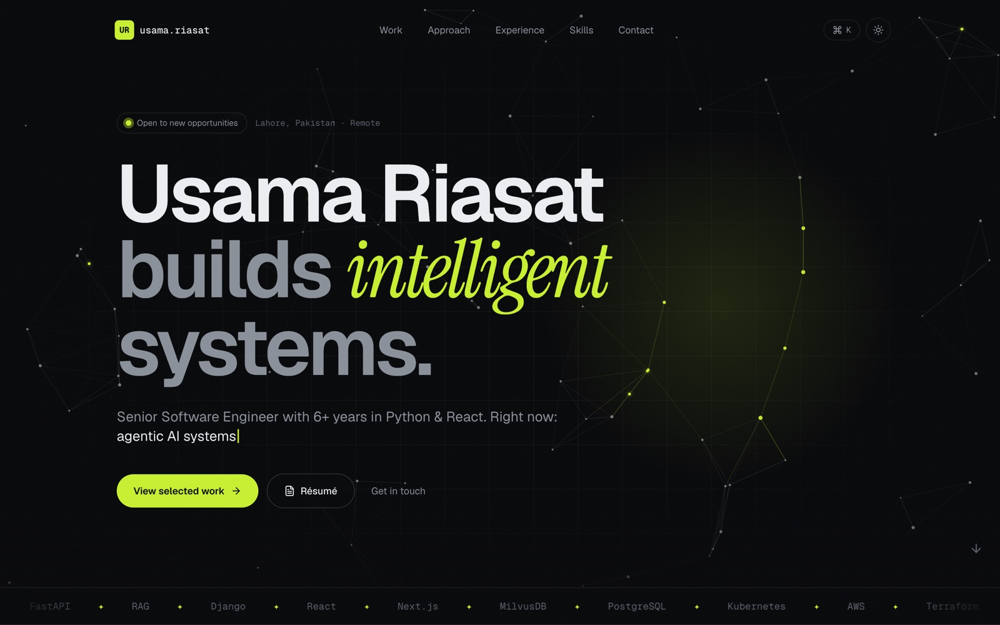
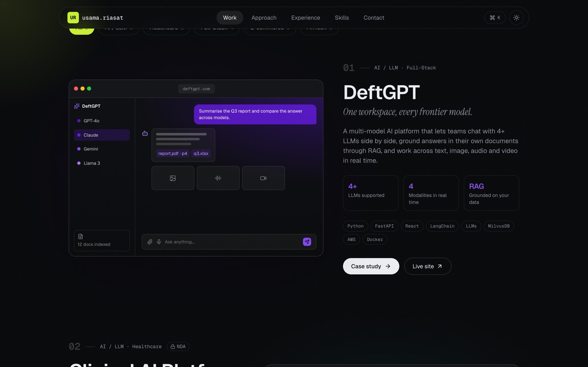
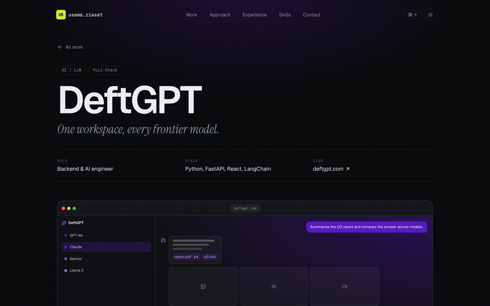
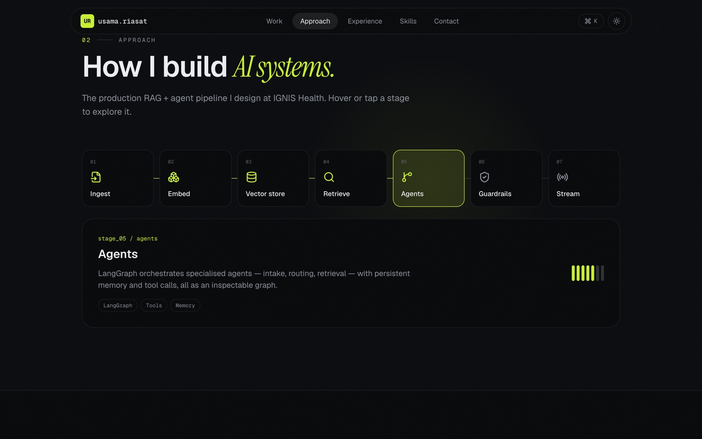
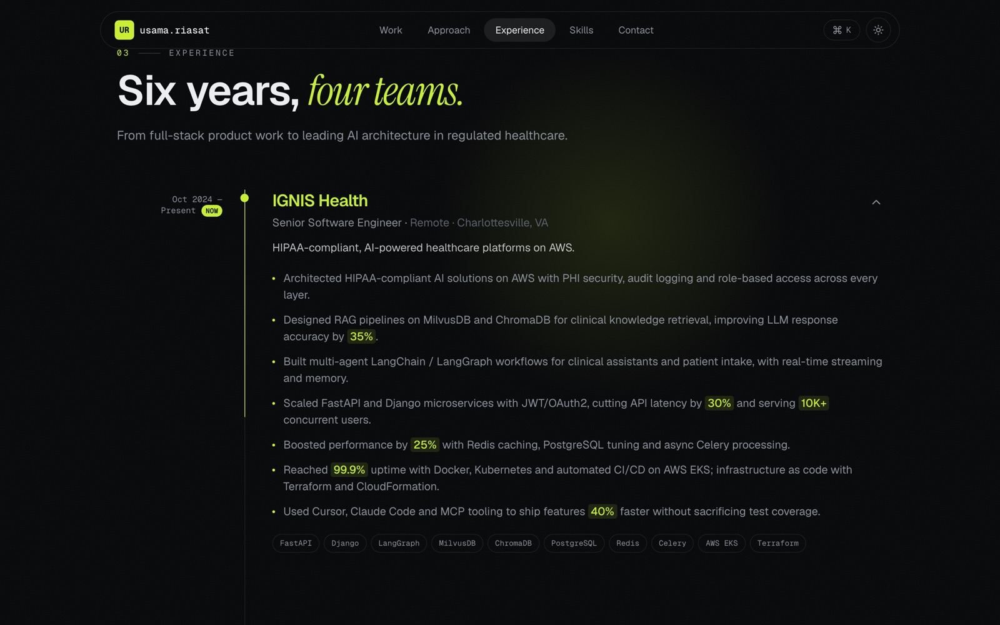
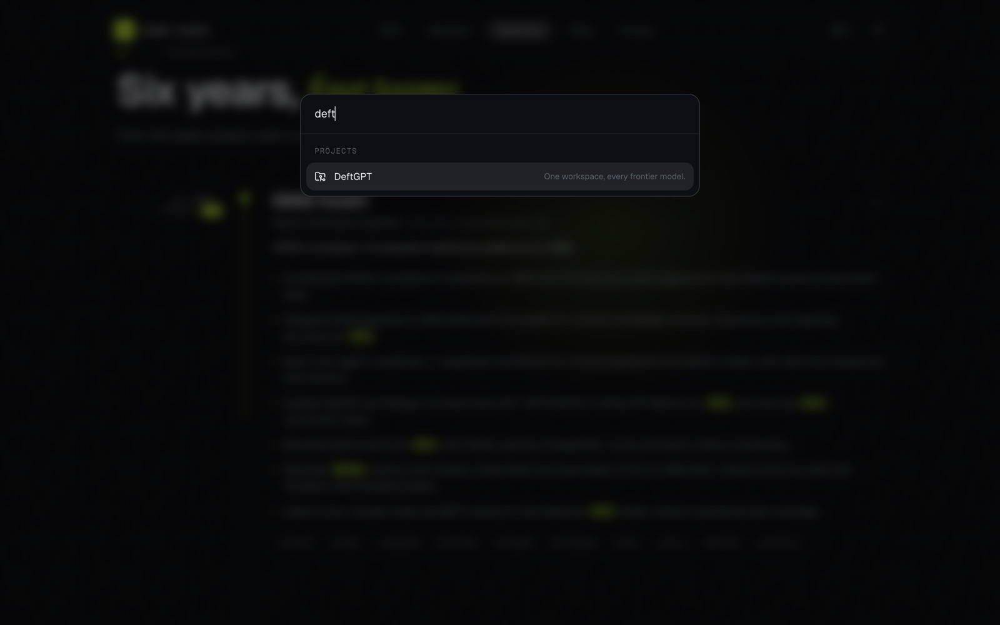
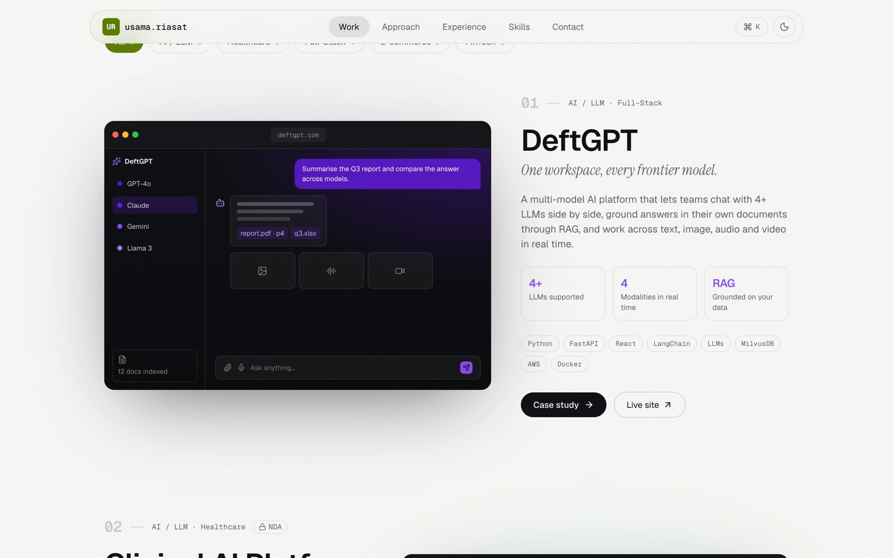
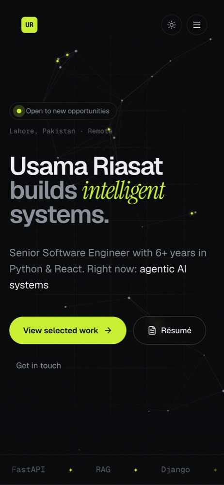
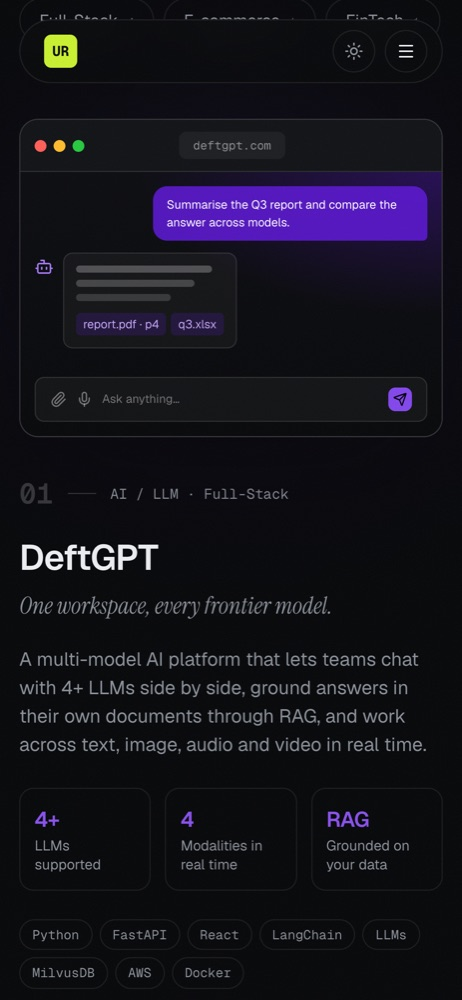
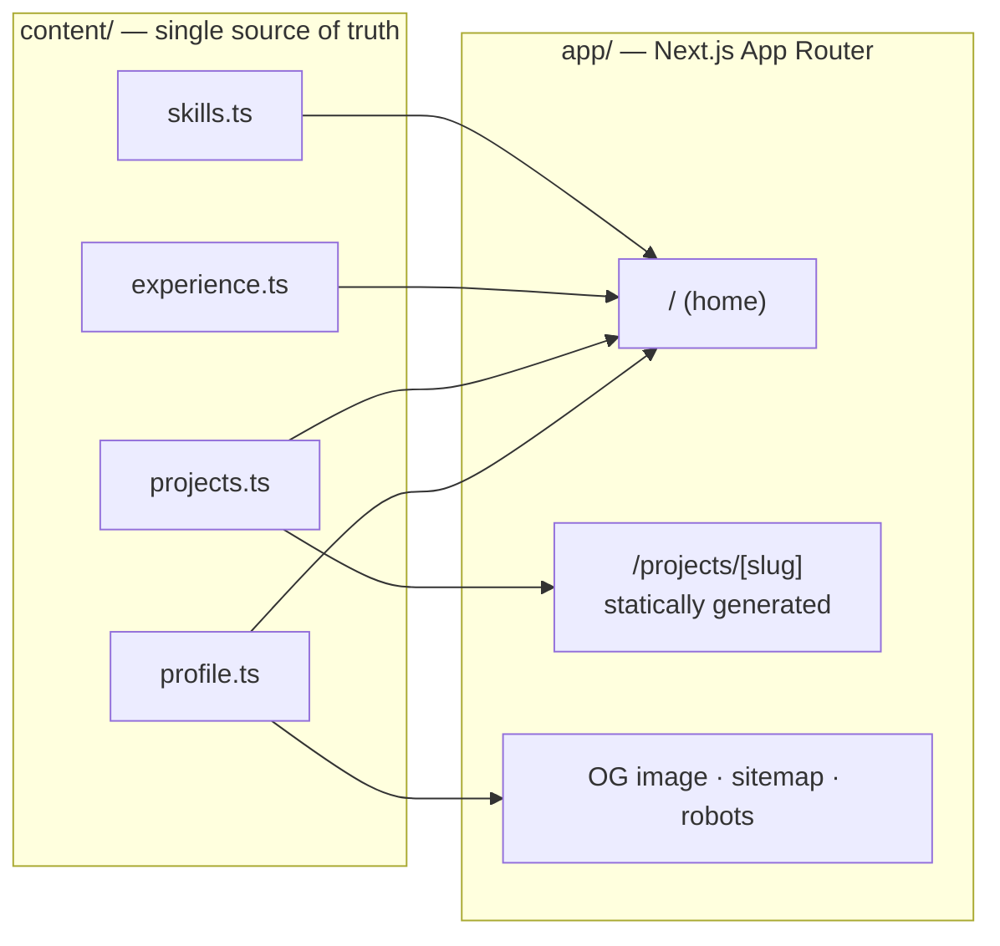

<div align="center">


# Usama Riasat — Portfolio

**Senior Software Engineer · Agentic AI · HIPAA-grade platforms**

An interactive, dark-first portfolio built to put the work front and center.

[](https://nextjs.org)
[](https://react.dev)
[](https://www.typescriptlang.org)
[](https://tailwindcss.com)
[](https://motion.dev)

[](https://www.linkedin.com/in/osamariasat/)
[](mailto:osamariasat@gmail.com)

<br />



</div>

<br />

```console
$ whoami
usama.riasat — senior software engineer, 6+ yrs

$ cat focus.txt
→ multi-agent LangGraph workflows & HIPAA-compliant RAG
→ FastAPI / Django microservices at 10K+ concurrent users
→ React front-ends that feel fast

$ open ./portfolio
✦ you are here
```

---

## ✦ What's inside

<table>
  <tr>
    <td width="50%" valign="top">
      
      <h3>Project showcase</h3>
      Large alternating case-study cards with 3D-tilt browser frames, pointer glare, key metrics, stack chips and category filters with shared-layout animation.
    </td>
    <td width="50%" valign="top">
      
      <h3>Case-study pages</h3>
      Every project gets a statically generated page: problem → solution → metrics → architecture flow → features → gallery with a keyboard-friendly lightbox.
    </td>
  </tr>
  <tr>
    <td width="50%" valign="top">
      
      <h3>Interactive AI pipeline</h3>
      A self-playing, hover-to-explore walkthrough of a production RAG + agents pipeline — the way to show NDA work without showing NDA screens.
    </td>
    <td width="50%" valign="top">
      
      <h3>Scroll-drawn timeline</h3>
      A timeline whose line draws itself as you scroll, with expandable roles and auto-highlighted metrics.
    </td>
  </tr>
  <tr>
    <td width="50%" valign="top">
      
      <h3>⌘K command palette</h3>
      Jump to any section or project, copy the email, open the résumé or flip the theme — all from the keyboard.
    </td>
    <td width="50%" valign="top">
      
      <h3>Light &amp; dark</h3>
      Token-driven theming with a flash-free boot script and a View Transitions cross-fade when you switch.
    </td>
  </tr>
</table>

<div align="center">
  
  &nbsp;&nbsp;
  
  <p><sub>Fully responsive — designed for phones, not just shrunk onto them.</sub></p>
</div>

### Small things that add up

- **Living hero** — a canvas node network where "packets" travel between agents and nodes lean toward your cursor
- **Illustrated product mocks** — until real screenshots land, each project renders its own tinted UI mock (the GoPainting one is actually interactive — hover the swatches)
- **Count-up impact stats**, typewriter intro, marquee stack strip, cursor spotlight, grain texture
- **Skill ↔ project linking** — hover any skill to see which projects used it
- **Respectful motion** — everything honours `prefers-reduced-motion`; canvases and autoplay pause when off-screen
- **SEO-ready** — per-page metadata, generated Open Graph image, JSON-LD `Person`, sitemap and robots

---

## ✦ How it's put together



```
.
├── app/
│   ├── page.tsx                 # home — composes the sections
│   ├── projects/[slug]/page.tsx # case studies (SSG via generateStaticParams)
│   ├── opengraph-image.tsx      # social card rendered at build time
│   └── layout.tsx               # fonts, theme boot script, nav, palette
├── components/
│   ├── sections/                # Hero, NodeGraph, Stats, Approach, Experience, Skills, Contact
│   ├── projects/                # Projects, ProjectCard, ProjectVisual, ProjectMock, Gallery
│   └── ui/                      # Reveal, SectionHeading, SmoothScroll, CursorGlow, ThemeToggle
├── content/                     # ← edit these to change the site
└── public/projects/<slug>/      # ← drop screenshots here
```

---

## ✦ Run it locally

```bash
git clone https://github.com/OsamaRiasat/usama-dev.git
cd usama-dev
npm install
npm run dev          # → http://localhost:3000
```

| Script          | Does                                  |
| --------------- | ------------------------------------- |
| `npm run dev`   | Dev server with Turbopack             |
| `npm run build` | Production build — every page static  |
| `npm run start` | Serve the production build            |
| `npm run lint`  | ESLint                                |

---

## ✦ Make it yours

All copy lives in **`content/`** — no digging through components.

| File              | Controls                                                               |
| ----------------- | ---------------------------------------------------------------------- |
| `profile.ts`      | Name, intro, typewriter phrases, impact stats, links, certificates     |
| `projects.ts`     | Projects & case studies — array order is display order                 |
| `experience.ts`   | Timeline — wrap numbers like `[[35%]]` to highlight them               |
| `skills.ts`       | Skills bento groups                                                    |

Theme colours are CSS tokens at the top of [`app/globals.css`](app/globals.css) — change `--accent` and the whole site follows.

### Adding project screenshots

Drop images into `public/projects/<slug>/` and reference them in that project's `images`:

```ts
images: {
  cover:   "/projects/deftgpt/cover.png",   // 1920×1080 — main browser-frame shot
  full:    "/projects/deftgpt/full.png",    // 1440px wide, any height — auto-scrolls on hover
  mobile:  "/projects/deftgpt/mobile.png",  // 390×844 — phone overlay
  gallery: ["/projects/deftgpt/chat.png"],  // case-study gallery + lightbox
},
```

No `cover`/`full` yet? The illustrated mock is shown automatically. Images are optimised to AVIF/WebP by `next/image`.

---

## ✦ Deploy

[](https://vercel.com/new/clone?repository-url=https://github.com/OsamaRiasat/usama-dev)

Set `NEXT_PUBLIC_SITE_URL` (e.g. `https://your-domain.dev`) so canonical, Open Graph and sitemap URLs point at your domain.

---

<div align="center">

**Built by [Usama Riasat](https://www.linkedin.com/in/osamariasat/)** — open to interesting problems.

<sub>Code is MIT-licensed. Personal content (text, résumé, images) is © Usama Riasat — please don't reuse it as-is.</sub>

</div>
